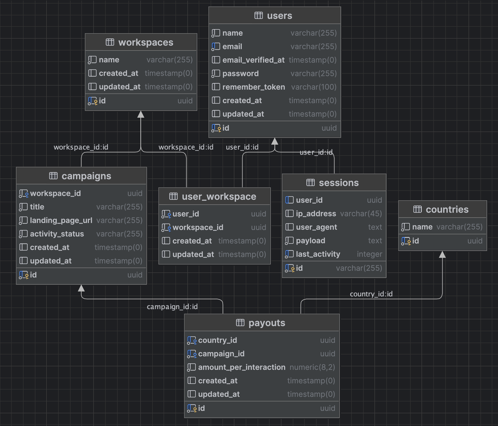

# Campaign Management Tool

## Installation

Composer dependencies

```bash
docker run --rm \
    -u "$(id -u):$(id -g)" \
    -v "$(pwd):/var/www/html" \
    -w /var/www/html \
    laravelsail/php84-composer:latest \
    composer install --ignore-platform-reqs
```

Create `.env` file

```bash
cp .env.example .env
```

Run docker container
`
./vendor/bin/sail up
`
or with bash alias

```bash
alias sail='[ -f sail ] && sh sail || sh vendor/bin/sail'

sail up
```

Generate `APP_KEY` `.env` variable

```bash
sail artisan key:generate
```

Run Database migrations

```bash
sail artisan migrate --seed
```

Install npm packages and start Vite dev server

```bash
sail npm i && sail npm run dev
```

Open up http://localhost and log in
```bash
user@example.com:password
```

## Running tests

```bash
sail test
```

## API docs

http://localhost/api/v1/docs

## ERD


